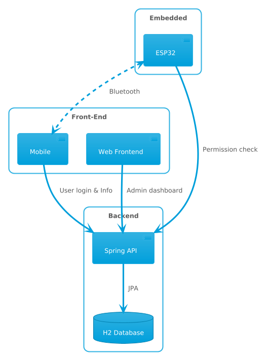

# TB3 Project - Système de Gestion d'Accès

Ce projet est un système complet de gestion d'accès pour portes automatiques. Il permet de contrôler l'accès via des badges physiques et mobiles, et offre une interface d'administration pour gérer les utilisateurs, les portes, les badges et les règles d'accès.

## Architecture du Projet

Le projet est composé de plusieurs modules :

- **Backend** : Une application Spring Boot (Java) qui gère la logique métier, la sécurité, et expose une API REST. 
- **Frontend** : Une application web développée avec Vue.js pour l'administration du système (gestion des utilisateurs, portes, logs d'accès, etc.).
- **Mobile** : Une application mobile pour l'utilisation de badges virtuels.
- **Embedded** : La partie logicielle embarquée pour le contrôle physique des serrures et lecteurs de badges.

## Diagramme d'Architecture

Voici une vue d'ensemble de l'architecture du système :

